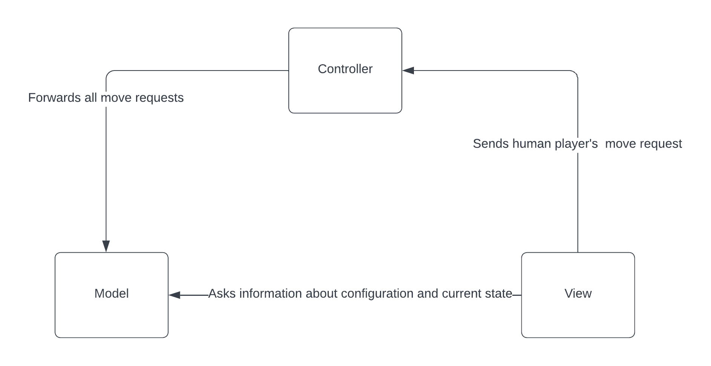
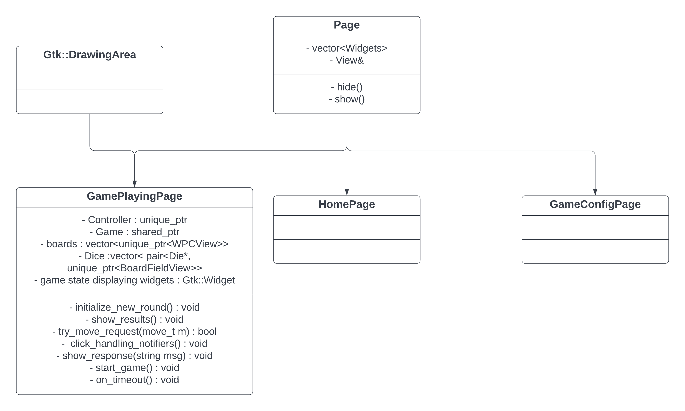
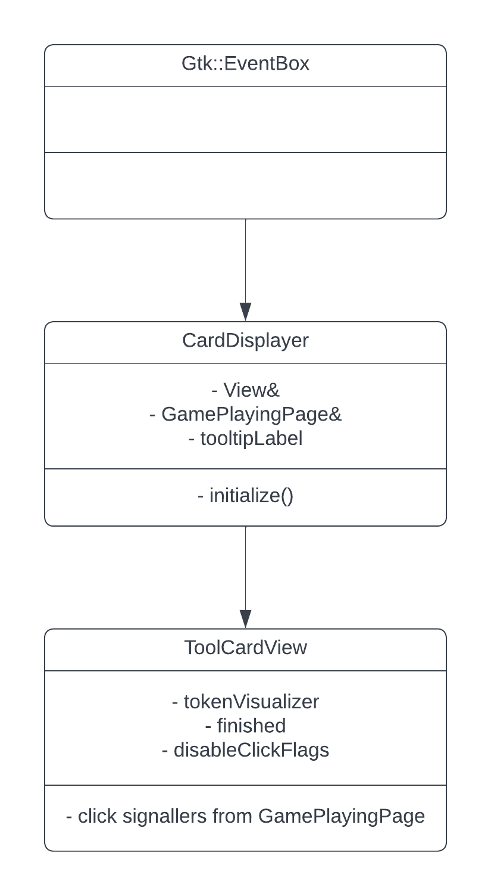

# **Developer documentation**

## **Basic information**

- The project is written in `C++` using the `C++20` standard version. The reason I chose the latest version of C++ is that it defines concepts that I am using to check at compile time whether certain classes fulfill the required template type (e.g. the local game card choosing).

- The game is visualized using the Gtkmm-3.0 graphical user interface library.

- The project supports the Windows and Linux operating systems. It was tested on both operating systems (Windows 11 and Linux - Ubuntu).

- There are the following folders in the top level of the repository:

  - **data** - contains data used in the e.g. the patterns for Window pattern cards
  - **doc** - contains both developer documentation (= this document) and user documentation
  - **include** - contains the header files of the project
  - **src** - contains the source files of the project
  - **subprojects** - contains the third party libraries used in the project
  - **tests** - contains the unit tests of the project including the testing data
  - **tournaments** - contains scripts to display statistics and run experiments
  - **tournament_results** - contains the results of the tournaments played as experiments
  - **log** - default logging directory

## Installation

All the third-party libraries are installed in the building step except for the [gtkmm-3.0](https://gtkmm.org/en/download.html) graphical user interface library.

To install this library, please follow the steps provided on the [official download page](https://www.gtkmm.org/en/download.html) according the OS you are building the project on.

## Build

- Building the project requires the [Meson](https://mesonbuild.com/) build system, the [Ninja](https://pypi.org/project/ninja/) build system and a C++ compiler that could compile C++20 features. The project is built using these commands:

  ```sh
  $ meson build
  $ ninja -C build
  $ build/sagrada
  ```

  This build by default does not use any compiler flags for code optimization. To produce an optimized build, add the `--buildtype=debugoptimized` flag to the `meson build` command.

- To generate [Doxygen](https://www.doxygen.nl/) documentation, run the following command:

  ```sh
  $ doxygen doc/Doxyfile
  ```

  It will generate the documentation to the `doxy_docs` directory.

## Commonly used terms

- The following abbreviations are used frequently in the game's source code and this documentation:
  - Window pattern cards -> WPC
  - Tool cards -> TC
  - Public objective cards -> PuOC
  - Private objective cards -> PrOC
    The list of all aliases used in the source code is present in the `Typedefs.h` header file.

## **Architecture**

The following UML diagram represents the architecture of the GUI mimicking the typical Model-View-Controller architecture. </br></br>

## **Model**

The model component is present for holding the data about the game (e.g. the chosen cards), the current state of the game(e.g. which player's turn it is) and the logic representing the rules of the game. There are approximately 5000 lines of code in the Model component including comments.

<div style="page-break-after: always;"></div>

### **Game**

The Game class is the main class of the model component. It holds together the static data of the game (GameContext object), the current state of the game (GameState object) and the history of moves that were sent before (GameHistory object). On the other hand, it defines the logic to handle moves i.e. creating the moves and evaluating the moves for correctness.

The most important functions of the Game class are:

- **move_c possible_moves()** - returns the possible moves for the current player
- **void move_request(move_t m)** - evaluates the move for correctness
- **void undo_last_move()** - performs the undo operation on the last move sent
- **eval_state_c evaluate()** - evaluates the current state of the game

### **GameContext** and **GameContextBuilder**

GameContext objects represent the static data about a given game (e.g. the dice and the different cards). It is implemented in a way to make it easy for the Game object (i.e. it didn't have to check for correctness) by making it hard to construct it wrongly. For this reason, it has a private constructor and defines the class GameContextBuilder as a friend class.

The GameContextBuilder class follows the **builder** design pattern. It allows to specialize every part of the GameContext with the corresponding setter function. This makes the model component easy to configure that way easy to test and easy to modify without recompilation.

The most important function of the GameContextBuilder class is:

- **game_context_t build(size_t playerCount, rnd_t rnd)** - this function creates a GameContext object from the data configured using the building functions. The `GameContextBuilder` class is designed in a way so it could handle multiple calls for this function on a single object of GameContextBuilder. Any data not configured before this function is called will be filled up with data from the default game.

The GameContexts are constructed from the JSON objects that are placed in the `data/GameConfigurations` directory. The JSON files have the following format:

```json
{
  "PuocConfig": {
    "puoc_contexts": [
      {
        "PuocId": 0,
        "SatisfactionValue": 5
      },
      {
        "PuocId": 1,
        "SatisfactionValue": 6
      },
      {
        "PuocId": 2,
        "SatisfactionValue": 4
      },
      {
        "PuocId": 3,
        "SatisfactionValue": 5
      },
      {
        "PuocId": 4,
        "SatisfactionValue": 2
      },
      {
        "PuocId": 5,
        "SatisfactionValue": 2
      },
      {
        "PuocId": 6,
        "SatisfactionValue": 2
      },
      {
        "PuocId": 7,
        "SatisfactionValue": 5
      },
      {
        "PuocId": 8,
        "SatisfactionValue": 4
      },
      {
        "PuocId": 9,
        "SatisfactionValue": 1
      }
    ],
    "cards_per_game": 3
  },
  "TcConfig": {
    "selectable_ids": [0, 1, 2, 3, 4, 5, 6, 7, 8, 9, 10, 11],
    "cards_per_game": 3
  },
  "PlayerCountRelatedInformation": [
    {
      "PlayerCount": 2,
      "DiceCount": 5
    },
    {
      "PlayerCount": 3,
      "DiceCount": 7
    },
    {
      "PlayerCount": 4,
      "DiceCount": 9
    }
  ],
  "DiceConfig": [
    {
      "Color": "Blue",
      "DiceCount": 18
    },
    {
      "Color": "Red",
      "DiceCount": 18
    },
    {
      "Color": "Green",
      "DiceCount": 18
    },
    {
      "Color": "Yellow",
      "DiceCount": 18
    },
    {
      "Color": "Purple",
      "DiceCount": 18
    }
  ],
  "ScoreContext": {
    "pointsPerUnusedFavorToken": 1,
    "minusPointsPerEmptyField": 1,
    "pointsPerProcValue": 1
  },
  "wpcChoicePerPlayer": 4,
  "NumberOfRounds": 10,
  "SelectableWPC": [
    "Lux Mundi",
    "Lux Astram",
    "Luz Celestial",
    "Fulgor del Cielo",
    "Shadow Thief",
    "Sun Catcher",
    "Bellesguard",
    "Batllo",
    "Sun's Glory",
    "Firelight",
    "Gravitas",
    "Water of Life",
    "Comitas",
    "Chromatic Splendor",
    "Aurora Sagradis",
    "Aurorae Magfinicus",
    "Firmitas",
    "Kaleidoscopic Dream",
    "Symphony of Light",
    "Virtus",
    "Via Lux",
    "Industria",
    "Fractal Drops",
    "Ripples of Light"
  ],
  "BoardConfig": {
    "BoardType": "Rectangle",
    "Width": 5,
    "Height": 4
  }
}
```

This configuration represents the official rules of the game. If any of the information provided in this example is missing, it is replaced by the same information from the default game e.g. if the "selectable_ids" of the "TcConfig" part is missing, automatically all the tool cards will be used.

### **GameCache**

The GameCache class follows the **singleton** design pattern. It defines a single static object that holds data that is the same for every game. Currently, it stores the Window pattern cards and the game modes that represent GameContext objects.

There is a static instance of `GameCacheInitializer` class that fills the GameCache instance before the main() function is called.

### **Board**

The board class represents the main functionalities performed on Board objects and holds the data.

BoardContext objects represent the data representing the boards. The main parts are a 2D array of board_field_t objects and a board_config_t representing the dimensions and the type of the boards.

The BoardConfig objects are cached each representing a Window pattern card defined in the `data/WindowPatternCards.txt` file.

### **Moves**

Instances of classes derived from the class Move represent the moves players can make in their turns. The two basic types of moves are basic moves and tool card moves. There is an enumeration type `Move::type` that represent these types saving some time on dynamic_casts.

The **basic moves** represent pass moves (class PassMove) and moves that place a die on the board (class DieToFieldMove). Handling these moves is the responsibility of the BasicMoveHandler class.

The **tool card moves** represent the moves that correspond to a given tool card. It is the responsibility of the given tool card to handle the moves.

Handling the moves consists of creating the moves, evaluating for correctness and performing the undo operation.

---

### **Tool cards**

Tool cards allow players to make special kinds of moves. Each tool card has a unique structure and a different influence on the game. They can modify different objects of the game. For this reason, there is a base class `ToolCard`. The different types of tool cards are represented by a derived class and an enumeration type `tc_etype`.

For easier construction, the `ToolCard` base class defines a `Factory` class having a single static `construct` method that receives the `tc_etype` representation of the tool card.

It defines the following interface to implement:

- **ToolCardUseFeedback use(tool_card_move, Game&)** - receives the already constructed tool card move that contains data about the move to be made. After error checking it modifies the state according to the type of the tool card. Throws an exception if the move is invalid for any reason. For some tool cards, it may happen that after a certain sub-move (that is not the last one) the player cannot continue using the tool card because there are no possible ways to continue. For example, the `Flux Bush` tool card (implemented by the `RerollDie` class), where the user first selects a die, rerolls it and has to place the rerolled die. However, in some cases the user cannot place the rerolled die and the last (= placing) sub-move cannot be made.

- **size_t favor_tokens_to_use()** - according to the game rules, every tool card costs 1 favor token for the first use and 2 after. This function is made virtual so it could be overridden for a concrete tool card if decided so.

- **void append_possible_moves(ToolCardAppendContext& ctx)** - when the game is collecting the possible moves to make for a player, it calls this method to append the moves that could be made using the tool card. It receives a `prevMove` argument which refers to the state of the tool card. This is important because there are tool cards using which consist of more than 1 move and the next move has to be appended according to this state.

- **ToolCardUseFeedback undo(tool_card_move_t& m, Game& g)** - performs the undo operation on a tool card move.

---

### **Public objective cards**

Public objective cards are present to determine the underlying strategy of the game. Each game has the purpose of placing dice on the board, but every game is scored differently due to the randomness of the public objective cards.

For easier construction, the `PublicObjectiveCard` base class defines a Factory class having a single static `construct` method that receives the type of the tool card.

It defines the following interface to implement:

- **puoc_pattern_t evaluate(OverallBoardState& overallState, board_t& board)** - This function evaluates the state of a board from the perspective of the given Public objective card. It contains the currently achieved points on the table and some information about the patterns' states. The pattern states are not evaluated correctly in every case because it would take a lot of time to precisely perform this operation and this function has to be fast because it is called a huge amount of times for state evaluation by the AI players.

### **Private objective cards**

Each player has a private objective card, which holds a color for which the player will receive bonus points. It is implemented as a wrapper around a `color_t` enum typed variable. These objects are immutable but this fact is not used anywhere in the program code currently.

---

### **Player Information**

The `PlayerInformation` struct describes the information that the game holds about each player. The players can access each other's player information including the board and all the information except for the private objective cards.

---

### **Dice**

The main moves of the game are placing a die on a board. The dice are randomly initialized at the beginning of the game. Their values could be changed using some tool cards.

Since there are no new dice constructed in the game, the `DiceSupply` singleton object holds all the dice in a vector, and in any other place in the source code pointers are used for these dice instances. It makes it easier to compare two dice as well because there could be more dice having the same color and value, but each die has a unique address, and if we usually want to refer to a specific die.

---

### **AI Players**

The `AI_Player` class describes the interface that the concrete AI players have to implement.

This class defines the following interface:

- **move_t make_next_move()** - Returns a move that the player chooses according to the strategy it implements.

---

## **View**

There are approximately 5000 lines of code in the View component including the comments.

Visualizing the game is done using two different ways:

- drawing components that change during the game - boards, dice, round track, etc. These are drawn using the Cairomm graphics library.
- using pre-drawn images for the components that do not change - cards = tool cards, public and private objective cards and their icons

The `View` component defines a class of the same name. The **View** class serves as a background for the application. It is derived from Gtk::DrawingArea to be able to make any changes in the background. It constructs the home page. It defines a function **change_page_to()** which receives the page to change to as a parameter. It owns the Gtk::Fixed object that is used in the whole application to place Gtk::Widgets objects at specific positions.

### **Pages**

The different stages that occur from opening the application until closing it are divided into pages.

Currently, there are 3 pages present:

- **Home page** - this is the page that is displayed when opening the application
- **Game config page** - this is the page where you configure the game you are trying to play - e.g. the number of players
- **Game playing page** - this is the page where the whole game is played

The interface for pages:

- **show()**, **hide()** - virtual methods that define what widgets have to be shown/hidden when switching between pages

#### **GamePlayingPage**

- This is the main page of the application. To make the interaction with the human player smoother so the AI players' moves would be followable, the moves are handled by a timeout handler. If it's an AI player's move, it reschedules a timeout, otherwise, it returns.

Using some of the tool cards requires extra settings. The reason is that they could consist of more than one move and after a given move, the tool card has to be used and there are no other options (e.g. placing any die on the board). This is handled by declaring flags whether the logic behind accepts clicks from given components. These flags are: `bool acceptDieClick`, `bool acceptBoardFieldClick`, `bool acceptRoundTrackClick`.

This class handles all the user interaction.

For each game, a new `GamePlayingPage` object is constructed.

<u>Most important methods</u>:

- **void board_field_clicked()**, **void handle_round_track_die_click()** - Since the objects such as the round track and the boards are derived from Gtk::DrawingArea, they receive the button_press event on their own and have to notify the page for getting an event.

- **bool try_move_request(move_t m)** - called by ToolCardView objects when a user move is detected. It sends the request to the **controller** object and handles the result by showing a response ( **show_response()** function) on failure and resetting the state in case of success.

- **void show_results()** - This method is called when the game has ended and the results of the game have to be shown.



---

### **BoardFieldView**

This class is used to represent both fields on the board and dice for different purposes such as the round track or the current rounds dice. An instance of this object is constructed with a position and size.

---

### **CardDisplayer**

The different cards are displayed using this class. Each type of card (Tool cards, Public/Private objective cards) displays its type of icon. When the user clicks on the icon, the cards are displayed. This class is derived from Gtk::EventBox because they display the cards by pre-drawn images and they have to accept events that Gtk::Image is not capable of.

<u>Most important methods</u>:

- **on_enter_notify_event()**, **on_leave_notify_event()** - GTK event handlers that are invoked when the user moves the mouse over the icon or leaves it. It displays a tooltip that displays what kind of cards the icon refers to.

- **on_button_press_event()** - A handler for a GTK event that occurs when the user clicks the icon. It displays all the cards that they refer to.

- **initialize()** - according to the type of cards that the icon refers to, this method receives those cards as an argument from the Game class

#### **ToolCardView**

Each tool card has a View class that represents how it reacts to user interaction. If a tool card is selected, all the board/round track/dice clicks are forwarded to the tool card's View handler and it handles what happens when these events occur.

These classes have the following inheritance structure:
</br>


---

## **Controller**

This component is responsible for forwarding requests from different components to the Model component. The two main components that use this layer are the View component and the Tournament framework.

The ControllerWithAIPlayer class is the base class for every controller type since currently there is no support for games between 2 or more local players that way each game contains at least 1 AI Player.

All 3 controllers serve as a middle layer between the game running component and the game model itself.

The most important functions of the 3 controllers are:

- `void ControllerWithAIPlayer::make_next_ai_player_move()` - calls the next AI player to make a move and forwards it to the game
- `only_ai_player_controller_t OnlyAIPlayerController::run_whole_game()` - runs the whole game between the AI players

## **Tests**

The unit tests of the project can be found in the <u>tests</u> directory. The project uses the `GoogleTest` testing framework.

Since the game uses a random configuration for each run, the tests include random tests as well. The game instances that the tests are run on are randomly initialized by default. However, testing specific parts of the game requires constructing the game from a configuration. This is provided by defining support for constructing game objects from **JSON** configuration.

### **Configuration**

The optional configuration file's name could be passed as a command-line argument after the `config_filename` keyword. The **bool SagradaTest::Init(int argc, char\*\* argv)** function processes the configuration file and constructs a `GameConfig` object from it. If the configuration file uses incorrect format, the **Init()** function returns false and the tests are not run.

Example of running the tests with a configuration file named `MyTestConfig.json`

```cpp
build/tests --config_filename tests/MyTestConfig.json
```

The configuration file must be in the following format:

- Public objective cards - receives an array of PuOC identifiers. The array is defined for key "puocIDs". It may contain any number of identifiers that could be used in the game (i.e. at most PublicObjectiveCards::cardsPerGame) including 0. The remaining IDs are filled randomly. Correctness of the IDs is checked in the **SagradaTest::Init()** method returning false for invalid IDs. The IDs must be in range [0, PublicObjectiveCards::totalCardCount).
- Tool cards - the same rules apply to Tool cards as for the Public objective cards with the correct constants and with the JSON key "tcIDs".
- Players - receives an array of PlayerInformation objects. The key for defining the player configuration array is "players". Each defined player must contain the PrivateObjectiveCard object defined inside the configuration. The **SagradaTest::Init()** function returns false if there is a player configuration without the PrivateObjectiveCard object defined. An additional
- Starting player ID - it could be defined using the key "playerStartingFirstRoundID". It accepts a single non-negative integer indicating which player will start the first round.

An example configuration that defines two Public objective cards (meaning that one will be chosen randomly) and two players having their Private objective cards color purple and red. The players have IDs 0 and 1. The configuration doesn't mention the Tool cards so they are chosen randomly.

```json
{
  "puocIDs": [0, 8],

  "players": [
    {
      "ID": 0,
      "PrivateObjectiveCard": {
        "Color": "Purple"
      }
    },
    {
      "ID": 1,
      "PrivateObjectiveCard": {
        "Color": "Red"
      }
    }
  ]
}
```
